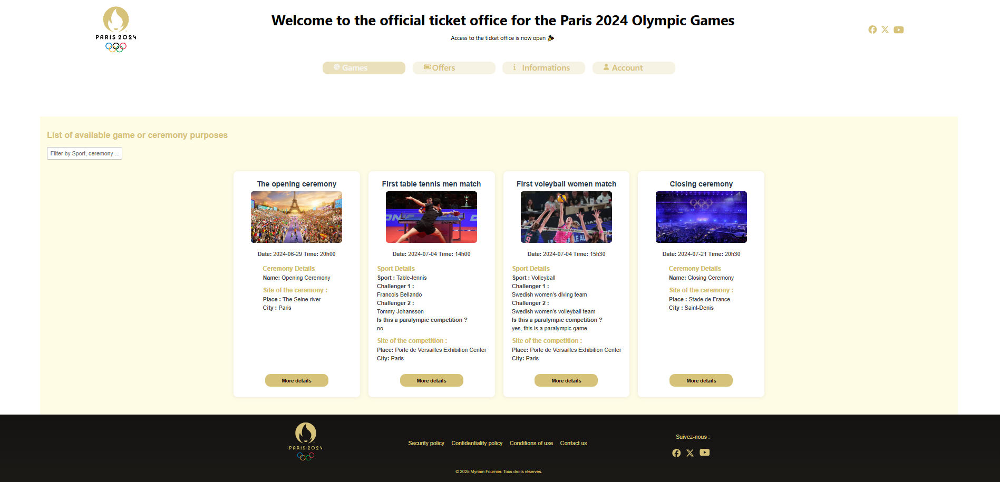
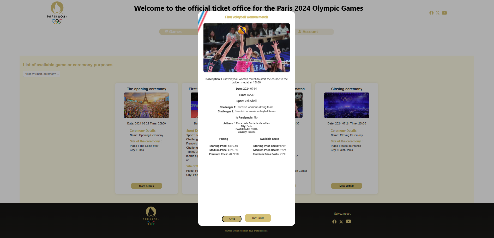
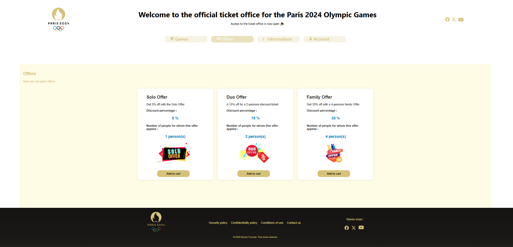

# Projet Java "2024_Olympics_Ticket_Office" (Sujet du Bloc3 du Bachelor Developpeur JAVA)

## L'API en images 

Comme une image vaut mille mots, voici à quoi ressemble l'application :

## Structure du projet
- `Backend/`: Contient l'API Spring Boot Java.
- `Frontend/`: Contient l'application Angular qui écoute le Json en sortie de backend et gère son affichage.

## Présentation

La présente application est une billetterie en ligne pour sélectionner et acheter des places aux différents évènements programmés pendant les jeux olympiques de Paris. 

Cette applciation se compose d'un Backend JAVA (API) et d'un Frontend Angular. Le projet suit le pattern MVC (Modèle - Vue Contrôleur). 

Bonne visite de mon application !

## Navigation

La page d'accueil de l'API est la page "Games" qui charge les cérémonies et les jeux. Vous pouvez afficher tous les détails de chaque carte via le bouton "More Details".
Un filtre vous permet également de cibler un sport, une date, le nom d'un sportif, les jeux de type paralympique, etc.

La seconde page "Offers" présente les offres Solo, Duo et Family, qu'il est possible d'ajouter au panier. Le pourcentage spécifique à l'offre choisie sera pris en compte pour le calcul du montant à régler.

La troisième page est la page "Informations" qui donne quelques informations utiles.

La dernière page est "Account" qui sert à tous type de compte pour se connecter, voir son panier, modifier ses informations personnelles, accéder à son/ses tickets achetés (à présenter au personnel de sécurité des Jeux Olympiques pour accéder à votre place), et si vous avez les droits spécifiques (administrateur ou employés), vous pourrez modifier et créer d'autres offres, et consulter le nombre de ventes.

Les politiques de sécurités sont accessibles depuis :
- un lien dédié dans le Footer du site
- la page de création de compte (Register), puisqu'il est obligatoire de les accepter pour s'enregistrer.

## Fonctionnalités

Pour les visiteurs :
- Voir l'ensemble de tous les évènements (cérémonie, match, course, etc)
- filter les évènements via un filtre de recherche
- Ouvrir un évènement en particulier (cérémonie, match, course, etc)
- L'ajouter au panier
- Choisir une offre promotionnelle parmi les 3 proposées
- Modifier le panier
- Transformer le panier en achat
- Créer un compte pour consulter le QRcode et autres détails des billets achetés, et pouvoir gérer ses informations personnelles

Pour les Gestionnaires :
- se connecter à l'espace d'administration 
- Créer, Ajouter, modifier, supprimer les offres 
- Consulter les ventes

## Comment lancer le projet ?

### Les outils indispensables :

Afin de pouvoir lancer le projet en local, vous devez avoir ces outils sur votre machine. Je vous détaille ici les versions utilisées : 
- pour la partie back
    - [Java JDK 17](https://adoptium.net/temurin/releases/)
    - [Maven](https://dlcdn.apache.org/maven/maven-3/3.8.6/binaries/apache-maven-3.8.7-bin.zip)
- pour la partie front
    - [nodeJS (LTS) version 22.14.0](https://nodejs.org/en/download/)
    - [yarn](https://classic.yarnpkg.com/lang/en/docs/install/)
    - [Angular CLI version 19.2.5](https://www.npmjs.com/package/@angular/cli/v/19.2.5)
- pour la partie base de données 
    - créez vous un compte sur [AlwaysData](https://www.alwaysdata.com/fr/)
    - créez une base de données Mysql, puis, un utilisateur avec les droits sur cette base de données
    - récupérez les informations de connexion à la base de données (nom de la base, nom de l'utilisateur, mot de passe, adresse de la base de données)
      - dans le fichier application.properties du projet back, remplacez les valeurs actuelles par les valeurs récupérées précédemment

      IMPORTANT : veillez à désactiver les bloqueurs de publicités et pop-up pour le locahost, sans quoi vous aurez sans doute des problèmes pour accéder au contenu.

      IMPORTANT : ne pas modifier ou supprimer la secret key définie dans applciations.properties (dossier "resources" du backend), car sans elle les comptes utilisateurs, employés et administrateurs créés ne seront plus accessibles. D'ailleurs il faut également ne pas supprimer ni modifier le fichier import.sql qui se trouve dans le même dossier, pour les mêmes raisons.

Je vous conseille les IDEs suivants :
- [IntelliJ](https://www.jetbrains.com/fr-fr/idea/download/) (pour le back)
- [WebStorm](https://www.jetbrains.com/fr-fr/webstorm/download/) (pour le front)
- [Visual Studio Code](https://code.visualstudio.com/)

### Commandes de lancement :

Pour lancer le projet, il faut lancer les commandes suivantes dans l'ordre :
- `mvn clean install` dans le dossier Backend
- `mvn spring-boot:run` dans le dossier Backend
- `yarn install` dans le dossier Frontend
- `yarn start` dans le dossier Frontend
- ouvrir votre navigateur sur l'adresse http://localhost:4200

## Technologies utilisées

SpringBoot version :                3.4.4
Maven version :                     3.8.6
JAVA version :                      JAVA JDK 17 LTS
Node version :                      22.14.0
Angular version :                   19.2.5 (CLI)

Les QRcodes sont générés via la dépendance Zxing.
La base de données choisie est MySQL.
Hibernate est présent dans ce projet pour la communication vers la base de données depuis les classes JAVA (Pojo)

## Pour votre information

### Commentaires dans le code :

    Les commentaires ont été volontairement rédigés en anglais, certaines parties sont doublées en français. L'idée étant de suivre les recommandations de codage.

### Respect des règles de rédaction : gestion des contraintes.

Le kamelCase pour les variables a été respecté le plus possible, seuls quelques cas de noms de variables composés de noms abrégés ont été délibéremment rédigés tout en minuscule, principalement pour forcer la bonne prise en compte syntaxique lors de la génération des tables MySQL.
Vous trouverez donc des underscores pour les Id. En effet lorsque les majuscules sont interprétées par MySQL elles sont le plus souvent (mais pas systématiquement) remplacées par des minuscules précédées d'un underscore, faisaint redouter que cela ne se passe pas forcément de la même façon sur différents setups.
D'où  fait que le kamelCase n'ait pas été respecté partout, l'enjeu étant que les datas présentes dans le fichier import.sql du dossier "resources" puissent être insérées dans les tables de la base de données. Les INSERT INTO contiennent les noms des champs et leur syntaxe doit être exactement la même que celle des champs des tables générées lors du lancement de l'application. 

Je vous remercie d'avoir consulté mon travail et espère qu'il vous aura plu !

       <      @Myriam Fournier - 2025      >

